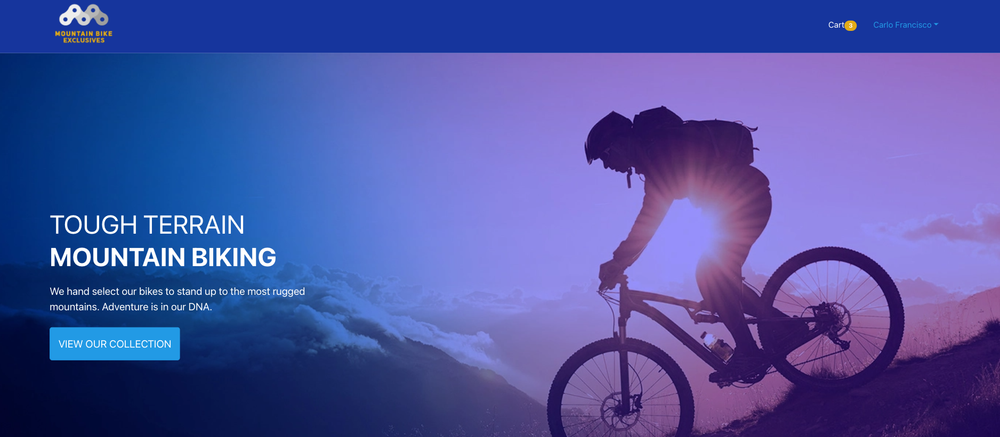
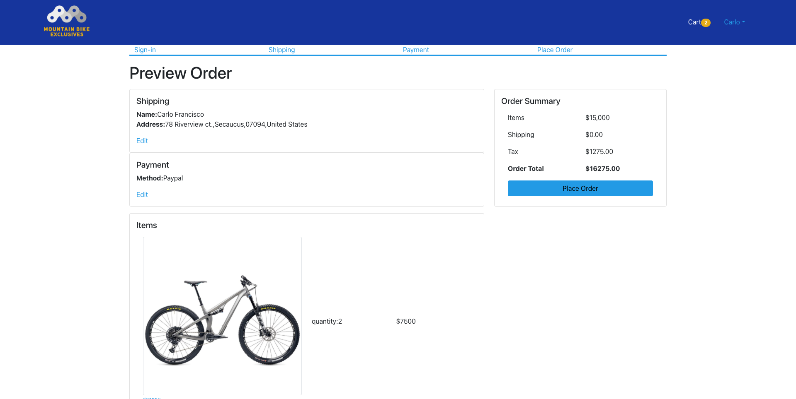

# Mountain Bike Exclusives

Responsive fullstack ecommerce application for fictious mountain bike business. You can add mountain bikes to cart. Create a login/profile. Select shipping, payment and checkout

Live demo [_here_](https://mtb-bike-shop.herokuapp.com/)

## Description

- Create-React-App that connects to a NodeJS and Express backend. Communicates data from Mongo Atlas database.
- Uses bcrypt for login and sign up
- Uses react-router-dom to link to different pages
- Uses react-router-hash-link to link to section of page
- Add to cart feature with max inventory handling
- state stored in local storage for cart and shipping form
- error handling with all forms

## Technologies Used

- React
- Hooks
- MongodDB
- NodeJS
- ExpressJS
- React Bootstrap

## Features

- Landing page with link to collection, cart, log in/sign up.
- can view details of individual bike product
- Shopping cart - can add and subtract items or delete all together
- proceed to check out - if not logged in will direct you to sign in / sign up page
- shipping page holds state in local storage
- payment method option
- checkout page with all shopping details

## Landing page



## Product check out



## 🛠️ Installation Steps

Install dependencies

```bash
npm install
```

### Executing program

- cd frontend
- npm start
- cd backend
- npm start

## Contact

Created by [@cfrancisco726](http://www.carlofrancisco.com) - feel free to contact me!
